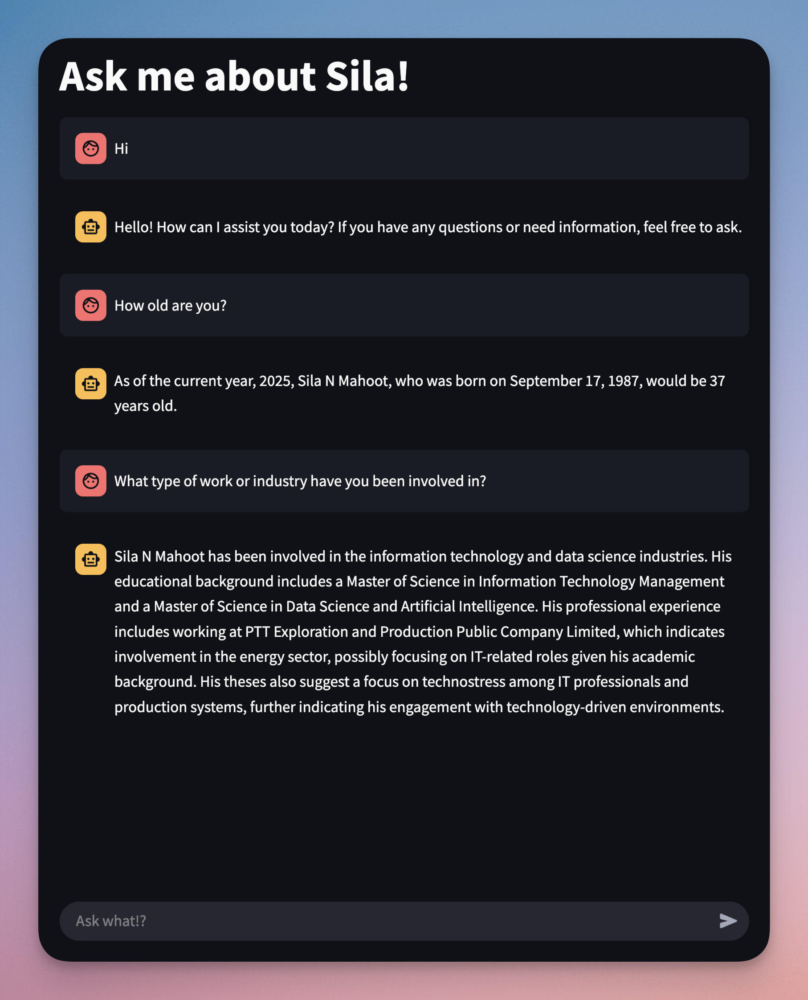

# Let's Talk to Myself

## Streamlit



## Implementation
...

## Sample Questions

<details>
  <summary>
    Expand to reveal the 10 pairs of question-answer in JSON format
  </summary>

```json
    {
        "question": "How old are you?",
        "answer": "Based on the information provided, you completed your Bachelor of Science degree in 2010. Assuming you were around 22 years old at the time of your graduation, you would have been born around 1988. Given that the current year is 2025, you would be approximately 37 years old.",
        "source_documents": [
        {
            "source": "./pdf/Application.pdf",
            "page": 8
        },
        {
            "source": "./pdf/CV.pdf",
            "page": 1
        },
        {
            "source": "./pdf/CV.pdf",
            "page": 0
        },
        {
            "source": "./pdf/Application.pdf",
            "page": 2
        }
        ]
    },
    {
        "question": "What is your highest level of education?",
        "answer": "Based on the provided context, your highest level of education is a degree in Computer Science, which you completed in May 2010.",
        "source_documents": [
        {
            "source": "./pdf/CV.pdf",
            "page": 1
        },
        {
            "source": "./pdf/Application.pdf",
            "page": 2
        },
        {
            "source": "./pdf/Application.pdf",
            "page": 3
        },
        {
            "source": "./pdf/Application.pdf",
            "page": 1
        }
        ]
    },
    {
        "question": "What major or field of study did you pursue during your education?",
        "answer": "You pursued a Bachelor of Science in Computer Science at Chiang Mai University in Thailand.",
        "source_documents": [
        {
            "source": "./pdf/Application.pdf",
            "page": 3
        },
        {
            "source": "./pdf/Application.pdf",
            "page": 1
        },
        {
            "source": "./pdf/Application.pdf",
            "page": 1
        },
        {
            "source": "./pdf/Application.pdf",
            "page": 2
        }
        ]
    },
    {
        "question": "How many years of work experience do you have?",
        "answer": "Based on the information provided, you completed your Bachelor of Science degree in Computer Science in 2010. Considering the current year is 2025, you would have approximately 15 years of work experience since completing your degree.",
        "source_documents": [
        {
            "source": "./pdf/Application.pdf",
            "page": 2
        },
        {
            "source": "./pdf/Application.pdf",
            "page": 2
        },
        {
            "source": "./pdf/Application.pdf",
            "page": 8
        },
        {
            "source": "./pdf/Application.pdf",
            "page": 1
        }
        ]
    },
    {
        "question": "What type of work or industry have you been involved in?",
        "answer": "Since completing your Bachelor of Science degree in Computer Science in 2010, you have been involved in various roles within the information technology and software development industries. Your work has included collaborating with departmental managers to develop and maintain IT systems, as well as creating in-house software for managing real-time data from sensors on a gas-producing platform. Additionally, you have obtained several certifications, such as the AWS Certified Cloud Practitioner and CompTIA Project+, which suggest a focus on cloud computing and project management in your professional endeavors. Your technical skills in areas like data science, machine learning, and programming also indicate a strong involvement in cutting-edge technology sectors.",
        "source_documents": [
        {
            "source": "./pdf/Application.pdf",
            "page": 1
        },
        {
            "source": "./pdf/Application.pdf",
            "page": 8
        },
        {
            "source": "./pdf/CV.pdf",
            "page": 1
        },
        {
            "source": "./pdf/Application.pdf",
            "page": 3
        }
        ]
    },
    {
        "question": "Can you describe your current role or job responsibilities?",
        "answer": "In my current role, I am heavily involved in the information technology and software development industries, focusing on creating and managing efficient IT systems and solutions that align with business needs. I collaborate closely with departmental managers to identify and implement cost-effective IT solutions. My responsibilities include developing in-house software to manage real-time data from over 100 sensors on a gas-producing platform, which enhances data visualization and management. Additionally, I provide comprehensive software and hardware support to over 500 users and manage 1,000 devices, ensuring minimal service downtime and improved resource management. My role also involves researching and ensuring the capacity of hosting facilities, network architecture, and other environmental systems to support current and future IT system expansions. With a strong foundation in data science and AI, I leverage these skills to extract insights from data, applying them to improve IT systems and data management. My technical expertise spans various programming languages and systems, including AWK, Bash, C#, Python, SQL, and more, which I use to drive innovation and efficiency in my projects.",
        "source_documents": [
        {
            "source": "./pdf/CV.pdf",
            "page": 1
        },
        {
            "source": "./pdf/CV.pdf",
            "page": 0
        },
        {
            "source": "./pdf/Application.pdf",
            "page": 2
        },
        {
            "source": "./pdf/Application.pdf",
            "page": 8
        }
        ]
    },
    {
        "question": "What are your core beliefs regarding the role of technology in shaping society?",
        "answer": "Based on the information provided about Sila N Mahoot, it seems that their core beliefs regarding the role of technology in shaping society might revolve around the transformative power of technology to improve and streamline processes, enhance productivity, and facilitate better decision-making. With a strong educational background in Information Technology Management and Data Science, Sila likely believes in the importance of using technology to address challenges such as technostress and retention in the IT industry, as evidenced by their thesis topics. Additionally, Sila's professional qualifications and interests in data science and AI suggest a belief in the critical role these technologies play in extracting valuable insights from data, which can be used to drive improvements in IT systems and overall data management. This indicates a belief in technology as a tool for innovation and efficiency that can positively impact various sectors and contribute to societal advancement.",
        "source_documents": [
        {
            "source": "./pdf/Application.pdf",
            "page": 7
        },
        {
            "source": "./pdf/CV.pdf",
            "page": 0
        },
        {
            "source": "./pdf/Application.pdf",
            "page": 2
        },
        {
            "source": "./pdf/Application.pdf",
            "page": 8
        }
        ]
    },
    {
        "question": "How do you think cultural values should influence technological advancements?",
        "answer": "Cultural values play a crucial role in shaping and guiding technological advancements. They provide a framework for understanding how technology can be developed and used responsibly and ethically. Here are some ways cultural values should influence technological advancements: 1. **Ethical Considerations**: Different cultures have varied ethical standards. These should guide the development and implementation of technology to ensure it aligns with societal values and norms. For instance, privacy and data protection are highly valued in many cultures, influencing how technologies like AI and data analytics are designed and deployed. 2. **Inclusivity and Accessibility**: Cultural values emphasize the importance of inclusivity and accessibility. Technological advancements should aim to bridge digital divides and ensure that all segments of society, regardless of their cultural or socioeconomic background, have access to technology. 3. **Sustainability**: Many cultures place a high value on environmental stewardship. This should influence technological advancements to focus on sustainable practices, reducing environmental impact, and promoting green technologies. 4. **Cultural Preservation**: Technology can be a powerful tool for preserving and promoting cultural heritage. Advancements should respect and incorporate cultural heritage, ensuring that modernization does not come at the expense of cultural identity. 5. **Social Impact**: Technological advancements should consider their social impact, guided by cultural values that prioritize community well-being and social cohesion. Technologies should aim to enhance quality of life and promote positive social change. 6. **Adaptability**: Cultural values can influence how adaptable and flexible technology should be to meet the diverse needs of different cultural contexts. This ensures that technology is relevant and beneficial to various cultural settings. By integrating cultural values into technological advancements, we can create technologies that are not only innovative but also ethically sound, socially responsible, and beneficial to society as a whole.",
        "source_documents": [
        {
            "source": "./pdf/Application.pdf",
            "page": 7
        },
        {
            "source": "./pdf/CV.pdf",
            "page": 0
        },
        {
            "source": "./pdf/Application.pdf",
            "page": 2
        },
        {
            "source": "./pdf/Application.pdf",
            "page": 2
        }
        ]
    },
    {
        "question": "As a master's student, what is the most challenging aspect of your studies so far?",
        "answer": "As a master's student, the most challenging aspect of my studies so far has been balancing the rigorous academic workload with the demands of my professional career. Pursuing a Master's degree in Data Science and Artificial Intelligence requires a deep commitment to understanding complex concepts and staying up-to-date with rapidly evolving technologies. Additionally, managing time effectively to ensure that I meet both academic deadlines and professional responsibilities can be quite demanding. However, this challenge has also been an opportunity for growth, as it has honed my time management skills and reinforced my dedication to advancing my expertise in this field.",
        "source_documents": [
        {
            "source": "./pdf/Application.pdf",
            "page": 2
        },
        {
            "source": "./pdf/Application.pdf",
            "page": 1
        },
        {
            "source": "./pdf/Application.pdf",
            "page": 2
        },
        {
            "source": "./pdf/Application.pdf",
            "page": 3
        }
        ]
    },
    {
        "question": "What specific research interests or academic goals do you hope to achieve during your time as a master's student?",
        "answer": "As a master's student in Data Science and Artificial Intelligence at the School of Engineering and Technology, I am eager to deepen my understanding of advanced data analysis techniques and machine learning algorithms. My specific research interests include: 1. **Machine Learning and Predictive Analytics**: I aim to explore innovative applications of machine learning models to predict trends and behaviors in various industries, such as healthcare, finance, and technology. 2. **Data-Driven Decision Making**: I am interested in developing methodologies that leverage data science to enhance decision-making processes within organizations, focusing on improving efficiency and effectiveness. 3. **AI in IT Systems Management**: I plan to investigate how artificial intelligence can be integrated into IT systems to optimize performance, automate routine tasks, and enhance data management practices. 4. **Ethical AI and Data Privacy**: Understanding the ethical implications of AI and ensuring data privacy and security are also key areas I wish to explore, aiming to contribute to responsible AI development. By pursuing these academic goals, I hope to acquire the skills and knowledge necessary to contribute to cutting-edge research and practical applications in the field of data science and artificial intelligence.",
        "source_documents": [
        {
            "source": "./pdf/Application.pdf",
            "page": 2
        },
        {
            "source": "./pdf/Application.pdf",
            "page": 2
        },
        {
            "source": "./pdf/Application.pdf",
            "page": 3
        },
        {
            "source": "./pdf/Application.pdf",
            "page": 0
        }
        ]
    }
```
</details>


## Analysis and Discussion

### List of the retriever and generator models I have utilized
Initially, I used **`fastchat-t5-3b-v1.0`** as my generator, but switching to **`GPT-4o`** via API significantly enhanced the response quality with more context-aware outputs.

On the retriever side, I started with **`hkunlp/instructor-base`** for embeddings. Upgrading to **`hkunlp/instructor-large`** greatly improved the precision of document retrieval, resulting in more relevant context for the generated responses.

### Potential Issues with Unrelated Information
The quality of both retrieval and context matters for getting good answers. If the embedding model or vector store does not match the question well, the retriever might bring back documents that are not closely related, which can confuse the generator. Using **`hkunlp/instructor-large`** gives more detailed embeddings, so it picks the right documents that match the question better.

On the generation side, **`GPT-4o`** is excellent at understanding the given context and following clear instructions. This reduces the chance of adding extra, unrelated details. I also use a clear prompt: “You are a helpful personal-information assistant. Provide gentle, informative, and respectful answers based on available data. Current year is 2025.” Including the current year helps in making accurate calculations, like determining age.

Together, using **`hkunlp/instructor-large`** and **`GPT-4o`**, along with a specific prompt, helps keep the answers focused and relevant.